# Market Segmentation with Clustering


```python
import numpy as np
import pandas as pd
import matplotlib.pyplot as plt
import seaborn as sns

#clustering model library
from sklearn.cluster import KMeans
from scipy.cluster.hierarchy import linkage, dendrogram
from sklearn.cluster import AgglomerativeClustering
```


```python
data = pd.read_csv('vacation.csv')
data.drop('Unnamed: 0', axis=1, inplace=True)
data.head()
```


<div>
<style scoped>
    .dataframe tbody tr th:only-of-type {
        vertical-align: middle;
    }

    .dataframe tbody tr th {
        vertical-align: top;
    }

    .dataframe thead th {
        text-align: right;
    }
</style>
<table border="1" class="dataframe">
  <thead>
    <tr style="text-align: right;">
      <th></th>
      <th>ID</th>
      <th>Gender</th>
      <th>Age</th>
      <th>Education</th>
      <th>Occupation</th>
      <th>State</th>
      <th>Relationship.Status</th>
      <th>Obligation</th>
      <th>Obligation2</th>
      <th>NEP</th>
      <th>...</th>
      <th>life style of the local people</th>
      <th>intense experience of nature</th>
      <th>cosiness/familiar atmosphere</th>
      <th>maintain unspoilt surroundings</th>
      <th>everything organised</th>
      <th>unspoilt nature/natural landscape</th>
      <th>cultural offers</th>
      <th>change of surroundings</th>
      <th>Income(k$)</th>
      <th>Expenditure</th>
    </tr>
  </thead>
  <tbody>
    <tr>
      <th>0</th>
      <td>1</td>
      <td>Female</td>
      <td>25</td>
      <td>6.0</td>
      <td>Clerical or service worker</td>
      <td>VIC</td>
      <td>single</td>
      <td>4.800000</td>
      <td>Q4</td>
      <td>3.200000</td>
      <td>...</td>
      <td>no</td>
      <td>no</td>
      <td>no</td>
      <td>no</td>
      <td>no</td>
      <td>no</td>
      <td>no</td>
      <td>no</td>
      <td>15.0</td>
      <td>39.0</td>
    </tr>
    <tr>
      <th>1</th>
      <td>2</td>
      <td>Female</td>
      <td>31</td>
      <td>8.0</td>
      <td>professional</td>
      <td>WA</td>
      <td>married</td>
      <td>3.300000</td>
      <td>Q1</td>
      <td>3.400000</td>
      <td>...</td>
      <td>yes</td>
      <td>no</td>
      <td>no</td>
      <td>no</td>
      <td>no</td>
      <td>no</td>
      <td>no</td>
      <td>yes</td>
      <td>15.0</td>
      <td>81.0</td>
    </tr>
    <tr>
      <th>2</th>
      <td>3</td>
      <td>Male</td>
      <td>21</td>
      <td>3.0</td>
      <td>NaN</td>
      <td>NSW</td>
      <td>single</td>
      <td>3.400000</td>
      <td>Q2</td>
      <td>3.066667</td>
      <td>...</td>
      <td>yes</td>
      <td>no</td>
      <td>yes</td>
      <td>no</td>
      <td>no</td>
      <td>no</td>
      <td>yes</td>
      <td>no</td>
      <td>16.0</td>
      <td>6.0</td>
    </tr>
    <tr>
      <th>3</th>
      <td>4</td>
      <td>Female</td>
      <td>18</td>
      <td>2.0</td>
      <td>unemployed</td>
      <td>NSW</td>
      <td>single</td>
      <td>2.633333</td>
      <td>Q1</td>
      <td>3.400000</td>
      <td>...</td>
      <td>no</td>
      <td>yes</td>
      <td>no</td>
      <td>no</td>
      <td>no</td>
      <td>no</td>
      <td>no</td>
      <td>yes</td>
      <td>16.0</td>
      <td>77.0</td>
    </tr>
    <tr>
      <th>4</th>
      <td>5</td>
      <td>Male</td>
      <td>61</td>
      <td>3.0</td>
      <td>retired</td>
      <td>WA</td>
      <td>married</td>
      <td>3.400000</td>
      <td>Q2</td>
      <td>3.733333</td>
      <td>...</td>
      <td>yes</td>
      <td>no</td>
      <td>no</td>
      <td>yes</td>
      <td>no</td>
      <td>no</td>
      <td>no</td>
      <td>no</td>
      <td>17.0</td>
      <td>40.0</td>
    </tr>
  </tbody>
</table>
<p>5 rows × 33 columns</p>
</div>


```python
data.info()
```

    <class 'pandas.core.frame.DataFrame'>
    RangeIndex: 1000 entries, 0 to 999
    Data columns (total 33 columns):
     #   Column                             Non-Null Count  Dtype  
    ---  ------                             --------------  -----  
     0   ID                                 1000 non-null   int64  
     1   Gender                             1000 non-null   object 
     2   Age                                1000 non-null   int64  
     3   Education                          992 non-null    float64
     4   Occupation                         941 non-null    object 
     5   State                              1000 non-null   object 
     6   Relationship.Status                996 non-null    object 
     7   Obligation                         1000 non-null   float64
     8   Obligation2                        1000 non-null   object 
     9   NEP                                1000 non-null   float64
     10  Vacation.Behaviour                 975 non-null    float64
     11  rest and relax                     1000 non-null   object 
     12  luxury / be spoilt                 1000 non-null   object 
     13  do sports                          1000 non-null   object 
     14  excitement, a challenge            1000 non-null   object 
     15  not exceed planned budget          1000 non-null   object 
     16  realise creativity                 1000 non-null   object 
     17  fun and entertainment              1000 non-null   object 
     18  good company                       1000 non-null   object 
     19  health and beauty                  1000 non-null   object 
     20  free-and-easy-going                1000 non-null   object 
     21  entertainment facilities           1000 non-null   object 
     22  not care about prices              1000 non-null   object 
     23  life style of the local people     1000 non-null   object 
     24  intense experience of nature       1000 non-null   object 
     25  cosiness/familiar atmosphere       1000 non-null   object 
     26  maintain unspoilt surroundings     1000 non-null   object 
     27  everything organised               1000 non-null   object 
     28  unspoilt nature/natural landscape  1000 non-null   object 
     29  cultural offers                    1000 non-null   object 
     30  change of surroundings             1000 non-null   object 
     31  Income(k$)                         200 non-null    float64
     32  Expenditure                        200 non-null    float64
    dtypes: float64(6), int64(2), object(25)
    memory usage: 257.9+ KB


```python
print(pd.isnull(data).sum())
```

    ID                                     0
    Gender                                 0
    Age                                    0
    Education                              8
    Occupation                            59
    State                                  0
    Relationship.Status                    4
    Obligation                             0
    Obligation2                            0
    NEP                                    0
    Vacation.Behaviour                    25
    rest and relax                         0
    luxury / be spoilt                     0
    do sports                              0
    excitement, a challenge                0
    not exceed planned budget              0
    realise creativity                     0
    fun and entertainment                  0
    good company                           0
    health and beauty                      0
    free-and-easy-going                    0
    entertainment facilities               0
    not care about prices                  0
    life style of the local people         0
    intense experience of nature           0
    cosiness/familiar atmosphere           0
    maintain unspoilt surroundings         0
    everything organised                   0
    unspoilt nature/natural landscape      0
    cultural offers                        0
    change of surroundings                 0
    Income(k$)                           800
    Expenditure                          800
    dtype: int64


```python
data.dropna(axis=0, how='any', thresh=None, subset=None, inplace=True)
print(pd.isnull(data).sum())
```

    ID                                   0
    Gender                               0
    Age                                  0
    Education                            0
    Occupation                           0
    State                                0
    Relationship.Status                  0
    Obligation                           0
    Obligation2                          0
    NEP                                  0
    Vacation.Behaviour                   0
    rest and relax                       0
    luxury / be spoilt                   0
    do sports                            0
    excitement, a challenge              0
    not exceed planned budget            0
    realise creativity                   0
    fun and entertainment                0
    good company                         0
    health and beauty                    0
    free-and-easy-going                  0
    entertainment facilities             0
    not care about prices                0
    life style of the local people       0
    intense experience of nature         0
    cosiness/familiar atmosphere         0
    maintain unspoilt surroundings       0
    everything organised                 0
    unspoilt nature/natural landscape    0
    cultural offers                      0
    change of surroundings               0
    Income(k$)                           0
    Expenditure                          0
    dtype: int64


```python
data.describe()
```


<div>
<style scoped>
    .dataframe tbody tr th:only-of-type {
        vertical-align: middle;
    }

    .dataframe tbody tr th {
        vertical-align: top;
    }

    .dataframe thead th {
        text-align: right;
    }
</style>
<table border="1" class="dataframe">
  <thead>
    <tr style="text-align: right;">
      <th></th>
      <th>ID</th>
      <th>Age</th>
      <th>Education</th>
      <th>Obligation</th>
      <th>NEP</th>
      <th>Vacation.Behaviour</th>
      <th>Income(k$)</th>
      <th>Expenditure</th>
    </tr>
  </thead>
  <tbody>
    <tr>
      <th>count</th>
      <td>188.000000</td>
      <td>188.000000</td>
      <td>188.000000</td>
      <td>188.000000</td>
      <td>188.000000</td>
      <td>188.000000</td>
      <td>188.000000</td>
      <td>188.000000</td>
    </tr>
    <tr>
      <th>mean</th>
      <td>100.617021</td>
      <td>44.776596</td>
      <td>5.037234</td>
      <td>3.762234</td>
      <td>3.664894</td>
      <td>2.936464</td>
      <td>60.611702</td>
      <td>51.005319</td>
    </tr>
    <tr>
      <th>std</th>
      <td>58.113591</td>
      <td>14.118031</td>
      <td>2.489270</td>
      <td>0.625359</td>
      <td>0.564779</td>
      <td>0.661095</td>
      <td>26.483842</td>
      <td>25.955020</td>
    </tr>
    <tr>
      <th>min</th>
      <td>1.000000</td>
      <td>18.000000</td>
      <td>1.000000</td>
      <td>1.000000</td>
      <td>2.266667</td>
      <td>1.551724</td>
      <td>15.000000</td>
      <td>1.000000</td>
    </tr>
    <tr>
      <th>25%</th>
      <td>50.750000</td>
      <td>35.000000</td>
      <td>3.000000</td>
      <td>3.433333</td>
      <td>3.266667</td>
      <td>2.410714</td>
      <td>41.500000</td>
      <td>35.000000</td>
    </tr>
    <tr>
      <th>50%</th>
      <td>101.500000</td>
      <td>42.000000</td>
      <td>6.000000</td>
      <td>3.833333</td>
      <td>3.666667</td>
      <td>2.929803</td>
      <td>62.000000</td>
      <td>50.000000</td>
    </tr>
    <tr>
      <th>75%</th>
      <td>150.250000</td>
      <td>58.000000</td>
      <td>7.000000</td>
      <td>4.141667</td>
      <td>4.133333</td>
      <td>3.435000</td>
      <td>78.000000</td>
      <td>73.000000</td>
    </tr>
    <tr>
      <th>max</th>
      <td>200.000000</td>
      <td>84.000000</td>
      <td>8.000000</td>
      <td>5.000000</td>
      <td>5.000000</td>
      <td>4.545455</td>
      <td>137.000000</td>
      <td>99.000000</td>
    </tr>
  </tbody>
</table>
</div>


```python
data.corr()
```


<div>
<style scoped>
    .dataframe tbody tr th:only-of-type {
        vertical-align: middle;
    }

    .dataframe tbody tr th {
        vertical-align: top;
    }

    .dataframe thead th {
        text-align: right;
    }
</style>
<table border="1" class="dataframe">
  <thead>
    <tr style="text-align: right;">
      <th></th>
      <th>ID</th>
      <th>Age</th>
      <th>Education</th>
      <th>Obligation</th>
      <th>NEP</th>
      <th>Vacation.Behaviour</th>
      <th>Income(k$)</th>
      <th>Expenditure</th>
    </tr>
  </thead>
  <tbody>
    <tr>
      <th>ID</th>
      <td>1.000000</td>
      <td>0.129412</td>
      <td>-0.145179</td>
      <td>-0.015188</td>
      <td>0.017554</td>
      <td>0.105743</td>
      <td>0.977143</td>
      <td>0.009035</td>
    </tr>
    <tr>
      <th>Age</th>
      <td>0.129412</td>
      <td>1.000000</td>
      <td>-0.217661</td>
      <td>0.096415</td>
      <td>0.091652</td>
      <td>0.088241</td>
      <td>0.148038</td>
      <td>-0.039035</td>
    </tr>
    <tr>
      <th>Education</th>
      <td>-0.145179</td>
      <td>-0.217661</td>
      <td>1.000000</td>
      <td>-0.102149</td>
      <td>-0.037483</td>
      <td>-0.105066</td>
      <td>-0.161605</td>
      <td>0.047340</td>
    </tr>
    <tr>
      <th>Obligation</th>
      <td>-0.015188</td>
      <td>0.096415</td>
      <td>-0.102149</td>
      <td>1.000000</td>
      <td>0.361037</td>
      <td>0.481686</td>
      <td>-0.033803</td>
      <td>-0.029299</td>
    </tr>
    <tr>
      <th>NEP</th>
      <td>0.017554</td>
      <td>0.091652</td>
      <td>-0.037483</td>
      <td>0.361037</td>
      <td>1.000000</td>
      <td>0.289770</td>
      <td>-0.012941</td>
      <td>0.008488</td>
    </tr>
    <tr>
      <th>Vacation.Behaviour</th>
      <td>0.105743</td>
      <td>0.088241</td>
      <td>-0.105066</td>
      <td>0.481686</td>
      <td>0.289770</td>
      <td>1.000000</td>
      <td>0.099979</td>
      <td>-0.031679</td>
    </tr>
    <tr>
      <th>Income(k$)</th>
      <td>0.977143</td>
      <td>0.148038</td>
      <td>-0.161605</td>
      <td>-0.033803</td>
      <td>-0.012941</td>
      <td>0.099979</td>
      <td>1.000000</td>
      <td>0.005775</td>
    </tr>
    <tr>
      <th>Expenditure</th>
      <td>0.009035</td>
      <td>-0.039035</td>
      <td>0.047340</td>
      <td>-0.029299</td>
      <td>0.008488</td>
      <td>-0.031679</td>
      <td>0.005775</td>
      <td>1.000000</td>
    </tr>
  </tbody>
</table>
</div>


```python
plt.figure(figsize=(7,7))
sns.heatmap(data.corr(), annot=True)
plt.show()
```


    

    


```python
labels = ['Male','Female']
sizes = [data.query('Gender == "Male"').Gender.count(),data.query('Gender == "Female"').Gender.count()]
#colors
colors = ['#ffdaB9','#66b3ff']
#explsion
explode = (0.05,0.05)
plt.figure(figsize=(8,8)) 
my_circle=plt.Circle( (0,0), 0.7, color='white')
plt.pie(sizes, colors = colors, labels=labels, autopct='%1.1f%%', startangle=90, pctdistance=0.85,explode=explode)
p=plt.gcf()
plt.axis('equal')
p.gca().add_artist(my_circle)
plt.show()
```


    
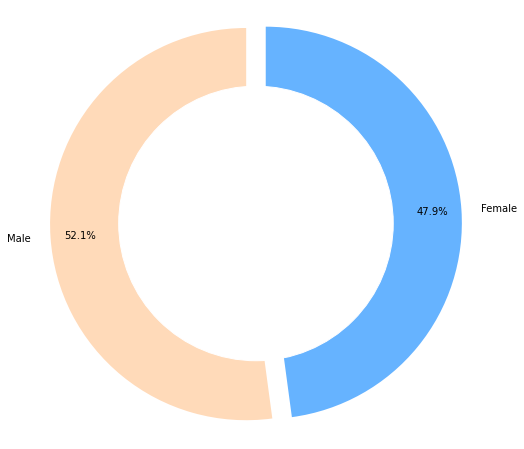
    


```python
plt.figure(figsize=(20,10))
sns.countplot(data.Age)
plt.xlabel("Age")
plt.ylabel("Person Count")
plt.show()
```

    /home/reddy/.local/lib/python3.10/site-packages/seaborn/_decorators.py:36: FutureWarning: Pass the following variable as a keyword arg: x. From version 0.12, the only valid positional argument will be `data`, and passing other arguments without an explicit keyword will result in an error or misinterpretation.
      warnings.warn(


    
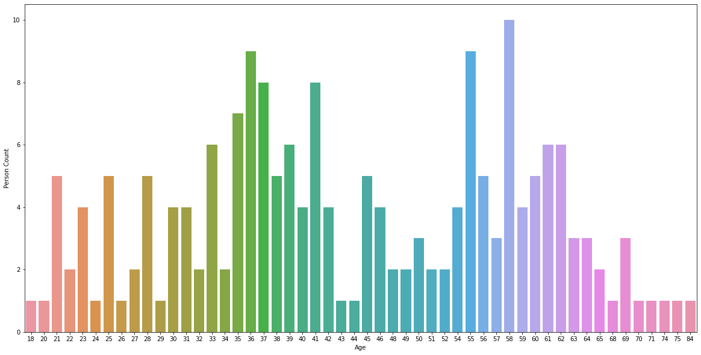
    


```python
plt.figure(figsize=(20,7))
gender = ['Male', 'Female']
for i in gender:
    plt.scatter(x='Age',y='Income(k$)', data=data[data['Gender']==i],s = 200 , alpha = 0.5 , label = i)
plt.legend()
plt.xlabel("Age")
plt.ylabel("Annual Income")
plt.title("Annual Income according to Age")
plt.show()
```


    
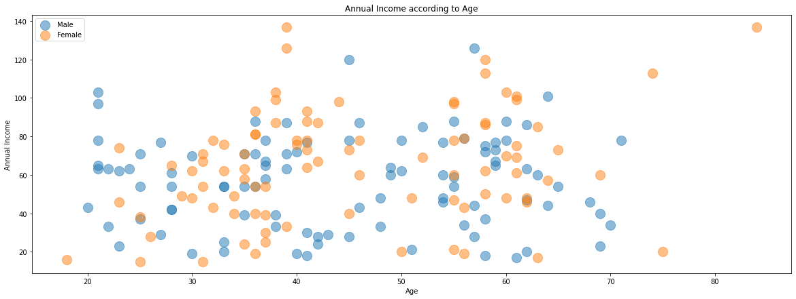
    


```python
plt.figure(figsize=(20,7))
gender = ['Male', 'Female']
for i in gender:
    plt.scatter(x='Age',y='Expenditure', data=data[data['Gender']==i],s = 200 , alpha = 0.5 , label = i)
plt.legend()
plt.xlabel("Age")
plt.ylabel("Expenditure(k$)")
plt.title("Expenditure according to Age")
plt.show()
```


    
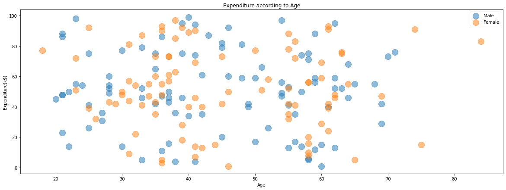
    


```python
plt.figure(figsize=(20,7))
gender = ['Male', 'Female']
for i in gender:
    plt.scatter(x='Age',y='Education', data=data[data['Gender']==i],s = 200 , alpha = 0.5 , label = i)
plt.legend()
plt.xlabel("Age")
plt.ylabel("Education")
plt.title("Education according to Age")
plt.show()
```


    
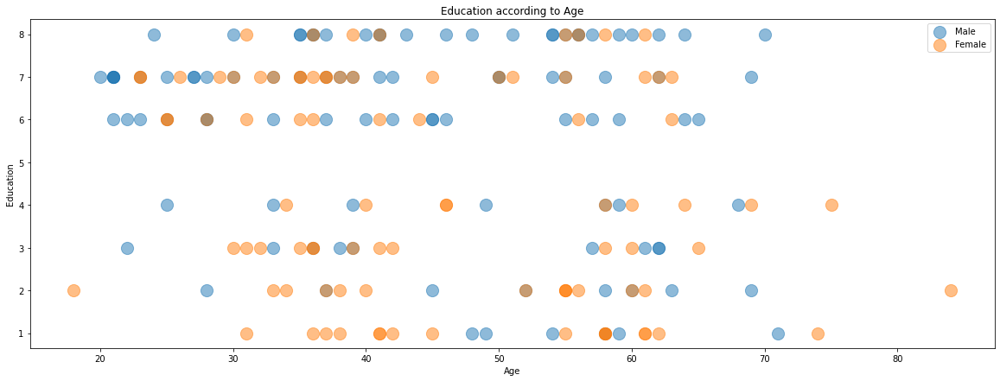
    


```python
plt.figure(figsize=(20,7))
gender = ['Male', 'Female']
for i in gender:
    plt.scatter(x='Income(k$)',y='Age', data=data[data['Gender']==i],s = 200 , alpha = 0.5 , label = i)
plt.legend()
plt.xlabel("Anual Income")
plt.ylabel("Age")
plt.title("Anual Income according to Age")
plt.show()
```


    
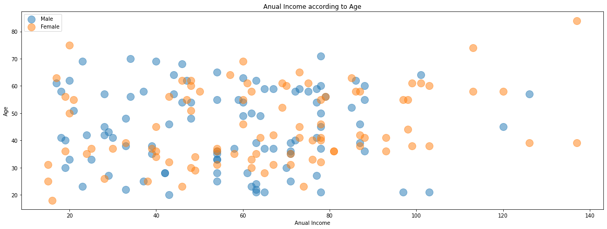
    


```python
plt.figure(figsize=(20,7))
gender = ['Male', 'Female']
for i in gender:
    plt.scatter(x='Expenditure',y='Income(k$)', data=data[data['Gender']==i],s = 200 , alpha = 0.5 , label = i)
plt.legend()
plt.xlabel("Expenditure")
plt.ylabel("Anual Income")
plt.title("Expenditure according to Anual Income")
plt.show()
```


    
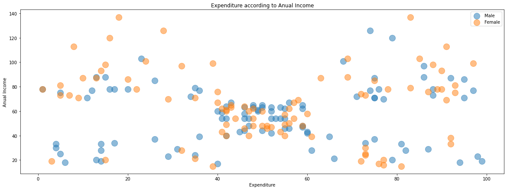
    


### Convert yes/no to 1/0


```python
data.replace(('yes', 'no'), (1, 0), inplace=True)
data.head()
```


<div>
<style scoped>
    .dataframe tbody tr th:only-of-type {
        vertical-align: middle;
    }

    .dataframe tbody tr th {
        vertical-align: top;
    }

    .dataframe thead th {
        text-align: right;
    }
</style>
<table border="1" class="dataframe">
  <thead>
    <tr style="text-align: right;">
      <th></th>
      <th>ID</th>
      <th>Gender</th>
      <th>Age</th>
      <th>Education</th>
      <th>Occupation</th>
      <th>State</th>
      <th>Relationship.Status</th>
      <th>Obligation</th>
      <th>Obligation2</th>
      <th>NEP</th>
      <th>...</th>
      <th>life style of the local people</th>
      <th>intense experience of nature</th>
      <th>cosiness/familiar atmosphere</th>
      <th>maintain unspoilt surroundings</th>
      <th>everything organised</th>
      <th>unspoilt nature/natural landscape</th>
      <th>cultural offers</th>
      <th>change of surroundings</th>
      <th>Income(k$)</th>
      <th>Expenditure</th>
    </tr>
  </thead>
  <tbody>
    <tr>
      <th>0</th>
      <td>1</td>
      <td>Female</td>
      <td>25</td>
      <td>6.0</td>
      <td>Clerical or service worker</td>
      <td>VIC</td>
      <td>single</td>
      <td>4.800000</td>
      <td>Q4</td>
      <td>3.200000</td>
      <td>...</td>
      <td>0</td>
      <td>0</td>
      <td>0</td>
      <td>0</td>
      <td>0</td>
      <td>0</td>
      <td>0</td>
      <td>0</td>
      <td>15.0</td>
      <td>39.0</td>
    </tr>
    <tr>
      <th>1</th>
      <td>2</td>
      <td>Female</td>
      <td>31</td>
      <td>8.0</td>
      <td>professional</td>
      <td>WA</td>
      <td>married</td>
      <td>3.300000</td>
      <td>Q1</td>
      <td>3.400000</td>
      <td>...</td>
      <td>1</td>
      <td>0</td>
      <td>0</td>
      <td>0</td>
      <td>0</td>
      <td>0</td>
      <td>0</td>
      <td>1</td>
      <td>15.0</td>
      <td>81.0</td>
    </tr>
    <tr>
      <th>3</th>
      <td>4</td>
      <td>Female</td>
      <td>18</td>
      <td>2.0</td>
      <td>unemployed</td>
      <td>NSW</td>
      <td>single</td>
      <td>2.633333</td>
      <td>Q1</td>
      <td>3.400000</td>
      <td>...</td>
      <td>0</td>
      <td>1</td>
      <td>0</td>
      <td>0</td>
      <td>0</td>
      <td>0</td>
      <td>0</td>
      <td>1</td>
      <td>16.0</td>
      <td>77.0</td>
    </tr>
    <tr>
      <th>4</th>
      <td>5</td>
      <td>Male</td>
      <td>61</td>
      <td>3.0</td>
      <td>retired</td>
      <td>WA</td>
      <td>married</td>
      <td>3.400000</td>
      <td>Q2</td>
      <td>3.733333</td>
      <td>...</td>
      <td>1</td>
      <td>0</td>
      <td>0</td>
      <td>1</td>
      <td>0</td>
      <td>0</td>
      <td>0</td>
      <td>0</td>
      <td>17.0</td>
      <td>40.0</td>
    </tr>
    <tr>
      <th>5</th>
      <td>6</td>
      <td>Female</td>
      <td>63</td>
      <td>7.0</td>
      <td>retired</td>
      <td>QLD</td>
      <td>married</td>
      <td>4.400000</td>
      <td>Q4</td>
      <td>4.266667</td>
      <td>...</td>
      <td>0</td>
      <td>0</td>
      <td>1</td>
      <td>0</td>
      <td>0</td>
      <td>0</td>
      <td>0</td>
      <td>0</td>
      <td>17.0</td>
      <td>76.0</td>
    </tr>
  </tbody>
</table>
<p>5 rows × 33 columns</p>
</div>


# Implement Clustering Algorithms

## K-Means Clustering Algorithm


```python
#define k value
from sklearn import preprocessing
wcss = []
data_model = data.drop(['Gender','ID','Occupation','State', 'Relationship.Status', 'Obligation2'],axis=1)
for k in range(1,15):
    kmeans = KMeans(n_clusters=k)
    kmeans.fit(data_model)
    wcss.append(kmeans.inertia_)

# the best value is elbow value. It's 5.
plt.figure(figsize=(15,5))
plt.plot(range(1,15),wcss)
plt.xlabel("number of k (cluster) value")
plt.ylabel("wcss")
plt.show()
```


    
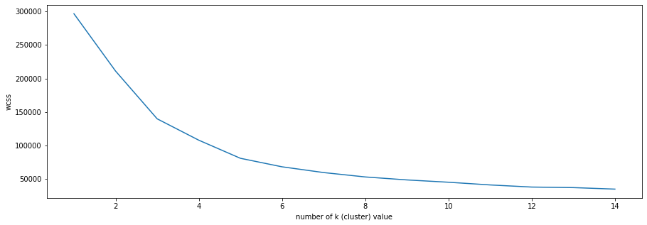
    


```python
#create model
kmeans = KMeans(n_clusters=5)
data_predict = kmeans.fit_predict(data_model)

plt.figure(figsize=(15,10))
plt.scatter( x = 'Income(k$)' ,y = 'Expenditure' , data = data_model , c = data_predict , s = 200 )
plt.xlabel("Annual Income (k$)")
plt.ylabel("Expenditure")
plt.show()
```


    
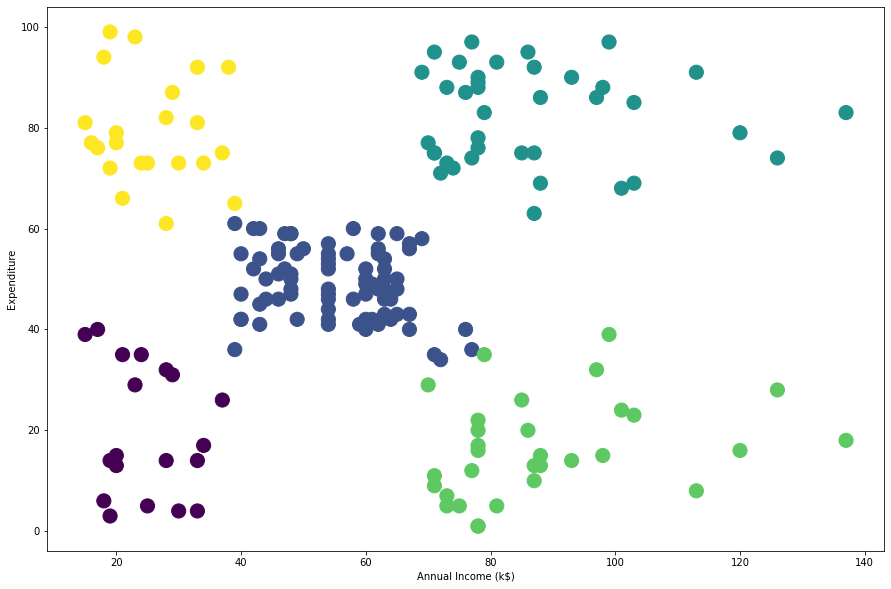
    


```python
#create demogram and find the best clustering value
merg = linkage(data_model,method="ward")
plt.figure(figsize=(25,10))
dendrogram(merg,leaf_rotation = 90)
plt.xlabel("data points")
plt.ylabel("euclidean distance")
plt.show()
```


    
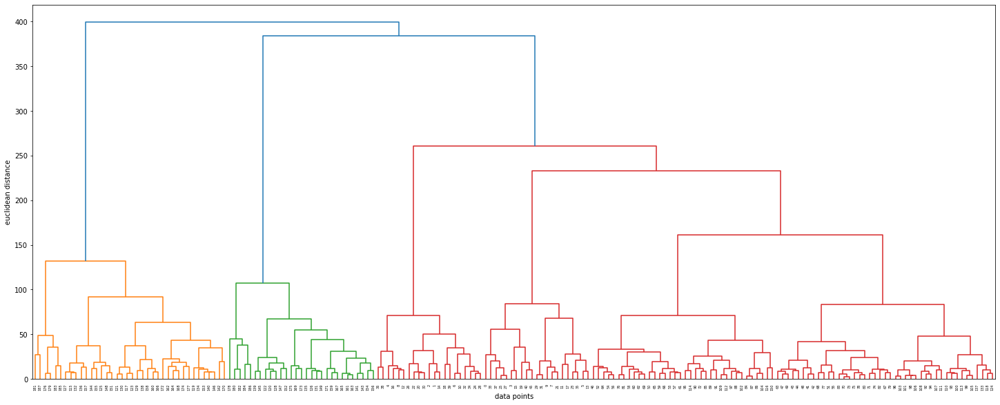
    


```python
#create model
hiyerartical_cluster = AgglomerativeClustering(n_clusters = 5,affinity= "euclidean",linkage = "ward")
data_predict = hiyerartical_cluster.fit_predict(data_model)
plt.figure(figsize=(15,10))
plt.scatter( x = 'Income(k$)' ,y = 'Expenditure' , data = data_model , c = data_predict , s = 200 )
plt.show()
```


    
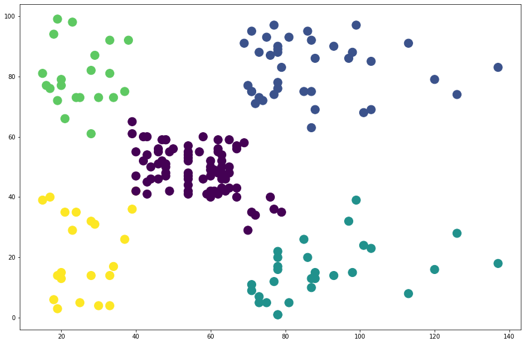
    
